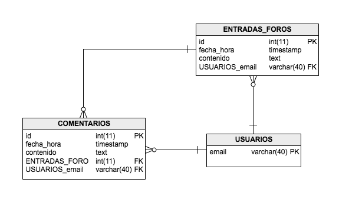
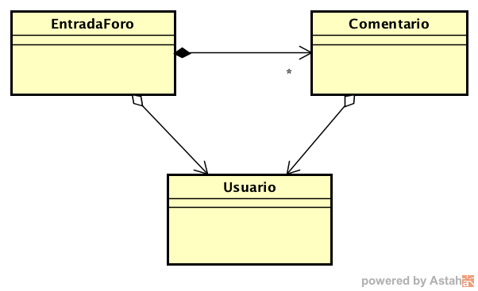

## Escuela Colombiana de Ingeniería

### PDSW – Procesos de desarrollo de Software
### Parcial Segundo Tercio

En los fuentes disponibles en el repositorio

<git@gitlab.com:PDSW/PDSW-2015-2-Par2T.git> se tiene la base de un
proyecto para la consulta de los comentarios que han registrado, a
través de una aplicación móvil, los suscriptores de una prestigiosa
editorial. La aplicación será usada por los empleados del departamento
de control de atención al cliente de dicha editorial, de acuerdo con lo
indicado en las siguientes historias de usuario:

  -------------------------------------------------------------------------------------------------------------------------------------------------------------------------------------
  > **Como** empleado del departamento de atención al cliente
  >
  > **Quiero** poder consultar todos los comentarios registrados hasta el momento
  >
  > **Para** poder identificar los comentarios que impliquen más riesgo de que se pierda una suscripción.
  >
  > **Criterio de aceptación:** los comentarios deben estar ordenados por fecha y deben mostrar: fecha, el comentario, y el nombre del cliente.
  -------------------------------------------------------------------------------------------------------------------------------------------------------------------------------------
  > **Como** empleado del departamento de atención al cliente
  >
  > **Quiero** poder consultar todos los comentarios registrados con un puntaje inferior a un valor N indicado
  >
  > **Para** poder identificar los problemas que están generando los impactos más negativos
  >
  > **Criterio de aceptación:** se debe permitir ingresar el valor N, los comentarios deben estar ordenados por fecha y deben mostrar: fecha, el comentario, y el nombre del cliente.
  -------------------------------------------------------------------------------------------------------------------------------------------------------------------------------------

El modelo de base de datos que soporta la información es el siguiente:

A partir de la aplicación base suministrada, debe realizar lo siguiente:

Dado un identificador de entrada foro ingresado, mostrar el enunciado del mismo y los comentarios realizados

Mostrar los foros que contengan entradas con malas palabras: carambolas y recorcholis

1.  (20%) A partir de la especificación hecha en los métodos
    *comentariosRegistrados* y *comentariosMasBajos* de la fachada de
    servicios (la parte lógica de la aplicación), defina e implemente
    una prueba para el primer método, y dos para el segundo (para este
    último, tenga en cuenta el concepto de clase de equivalencia para
    que las dos pruebas sean de diferente naturaleza). Recuerde que para
    hacer las pruebas, debe usar la fachada de servicios con el archivo
    de configuración que hace uso de una base de datos ‘volátil’ H2:
    h2\_applicationconfig.properties.

2.  (40%) Termine la implementación de **SÓLO UNO** de los dos DAOs
    concretos (el de JDBC o el de MyBATIS, usted decide cual). Recuerde
    ajustar los archivos de configuración (applicationconfig.properties
    y h2\_applicationconfig.properties) para que la fábrica de DAOs cree
    la fábrica concreta que corresponda a la que usted decidió
    implementar.

3.  (40%) En las dos páginas xhtml provistas, implemente las dos
    historias de usuario indicadas. Si hace uso de maven para correr la
    aplicación (mvn tomcat7:run), por la configuración dada la aplicación
    será accesible desde:

http://localhost:8080/app/faces/
